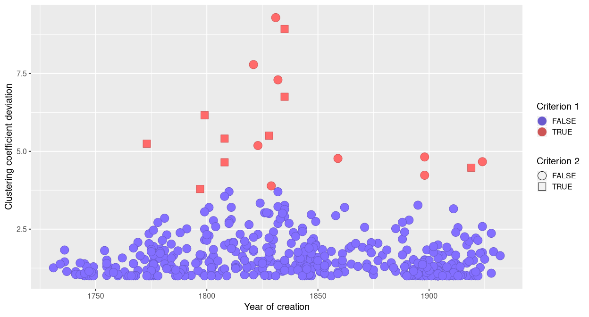
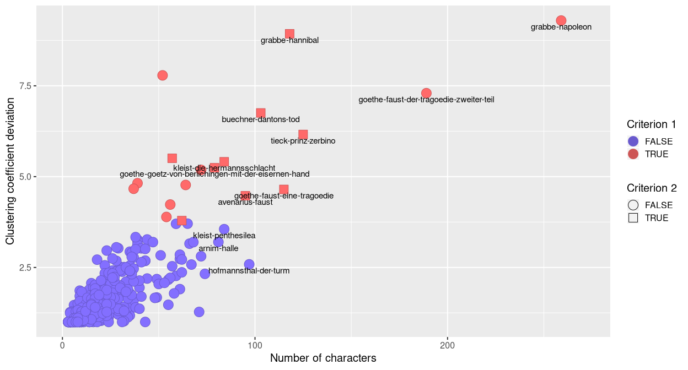
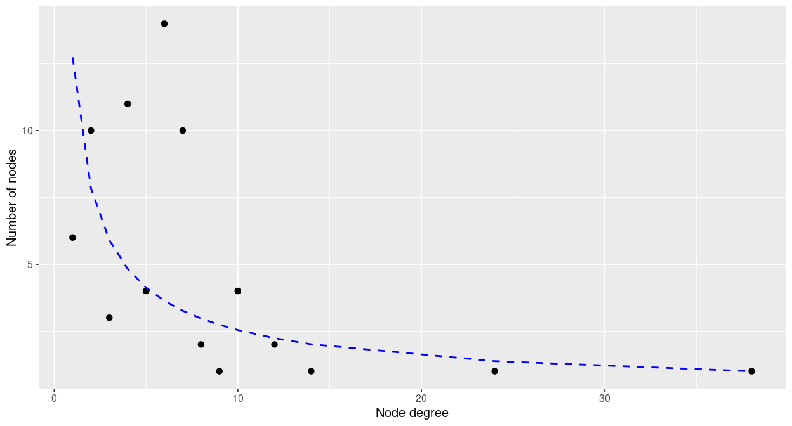
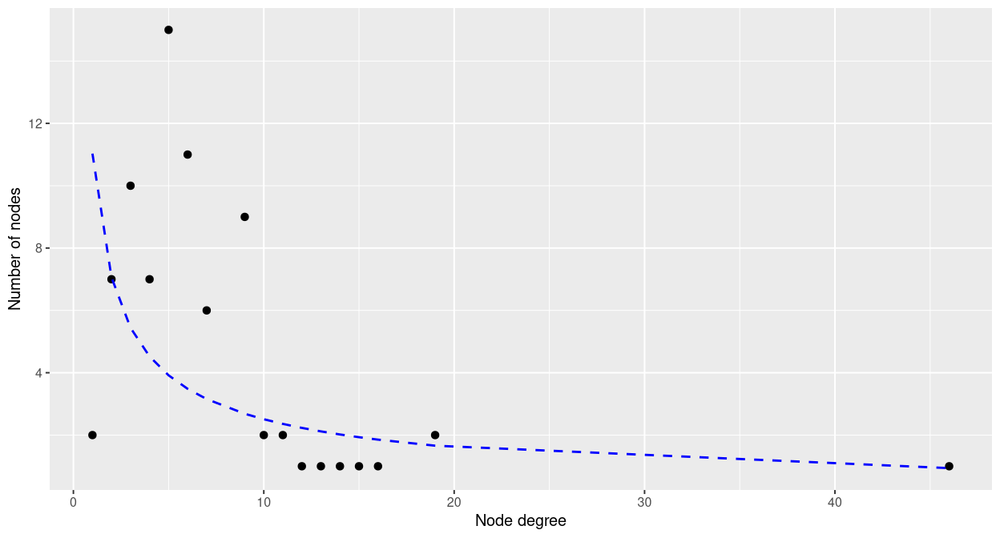

Small worlds in German drama corpus
================
Ustinova Eugenia
December 15, 2018

## Preprocessing

Choice of the corpus

``` r
corpusname <- "ger"
```

Downloading CSV files of
plays

``` r
list_of_names <- fromJSON(paste0("https://dracor.org/api/corpora/", corpusname))
sorted_ids <- list_of_names$dramas$id[sort.list(list_of_names$dramas$id)]
plays <- lapply(sorted_ids, function(x) read.csv(paste0("https://dracor.org/api/corpora/", 
                  corpusname, "/play/", x, "/networkdata/csv"), stringsAsFactors = F))
```

Removing of ‘Type’ and ‘Weight’ variables

``` r
del_vars <- function(play){
  play$Type <- NULL
  play$Weight <- NULL
  return (play)
}
plays <- mclapply(plays, del_vars)
```

Downloading
metadata

``` r
metadata <- read.csv(paste0("https://dracor.org/api/corpora/", corpusname, "/metadata.csv"),
                     stringsAsFactors = F)
metadata <- metadata[order(metadata$name),]
```

Creating graphs of
plays

``` r
graphs_of_plays <- mclapply(plays, function(x) graph_from_data_frame(x, directed = F))
```

## Clustering coefficient and average path length

Calculations of clustering coefficient (CC) and average path length
(APL)

``` r
CC <- sapply(graphs_of_plays, transitivity)
APL <- sapply(graphs_of_plays, function(x) mean_distance(x, directed=F))

df <- subset(metadata, select = c(name, year, numOfSpeakers) )
df$CC = CC
df$APL = APL
```

This function generates random graphs and calculates metrics (CC and
APL) for them

``` r
set.seed(42)
randomize_graph <- function(graph){
  random_graphs=list(1000)
  random_graphs <- lapply(random_graphs, function(x) 
                          x <- sample_gnm(gorder(graph), gsize(graph), directed = F, loops = F))
  kilo_CC <- sapply(random_graphs, transitivity)
  kilo_APL <- sapply(random_graphs, function(x) mean_distance(x, directed=F))
  results <- list()
  results$CC_rand <- mean(kilo_CC)
  results$APL_rand <- mean(kilo_APL)
  return(results)
}
```

Calculations of deviations of metrics for real networks from random ones

``` r
metrics_for_rand_graphs <- lapply(graphs_of_plays, randomize_graph)
matrix_metrics <- t(sapply(metrics_for_rand_graphs, unlist))

df$CC_rand=matrix_metrics[,1]
df$APL_rand=matrix_metrics[,2]

df <- transform(df, CC_dev = CC / CC_rand )
df <- transform(df, APL_dev = APL / APL_rand )

is.na(df) <- do.call(cbind,lapply(df, is.infinite))
```

Calculations of border values

``` r
CC_border <- mean(df$CC_dev, na.rm = TRUE)+2*sd(df$CC_dev, na.rm = TRUE)
APL_border_min <- mean(df$APL_dev, na.rm = TRUE)-2*sd(df$APL_dev, na.rm = TRUE)
APL_border_max <- mean(df$APL_dev, na.rm = TRUE)+2*sd(df$APL_dev, na.rm = TRUE)
```

Clustering coefficient deviation must be greater or equal to 3.7992528.
Average path length deviation must be in the interval \[0.8689946;
1.1611607\].

Applying criteria

``` r
df$crit_1 <- ifelse(df$CC_dev>=CC_border, TRUE, FALSE)
df$crit_2 <- ifelse((df$crit_1 == TRUE) &
                    (df$APL_dev >= APL_border_min) & 
                    (df$APL_dev<=APL_border_max), TRUE, FALSE)
```

## Power law distribution

Creation of node-degree distribution of plays’ graphs.

``` r
degree_dist <- lapply(graphs_of_plays,
                      function(x) degree(x, v = V(x), loops = FALSE, normalized = FALSE))
degree_dist_v <- lapply(degree_dist, as.vector)
number_of_nodes <- lapply(degree_dist_v, table)
distribution <- lapply(number_of_nodes, as.data.frame)

num_type <- function(x){
  x$Var1 <- as.numeric(as.character(x$Var1))
  x$Freq <- as.numeric(x$Freq)
  names(x) <- c("Node_degree", "Num_of_nodes")
  x
}

distribution <- lapply(distribution, num_type)
```

Fitting logarithms of distributions to linear regression and calculating
of R² (coefficient of determination) for each model
(play).

``` r
fit <- lapply(distribution, function(x) lm(log(x$Num_of_nodes) ~ log(x$Node_degree)))
df$Rsqrt <- sapply (fit, function(x) summary(x)$r.squared)
```

The dataframe with networks, which satisfy two first criteria and their
R².

``` r
small_worlds <- na.omit(df[df$crit_2 == TRUE,])
small_worlds_out <- subset(small_worlds, select = c(-crit_1, -crit_2, -CC_rand, -APL_rand))
kable(subset(small_worlds, select = c(-crit_1, -crit_2, -CC_rand, -APL_rand)))
```

|     | name                                                | year | numOfSpeakers |        CC |      APL |  CC\_dev |  APL\_dev |     Rsqrt |
| --- | :-------------------------------------------------- | ---: | ------------: | --------: | -------: | -------: | --------: | --------: |
| 14  | avenarius-faust                                     | 1919 |            95 | 0.6631684 | 1.815314 | 4.863235 | 0.9310104 | 0.0727248 |
| 24  | beer-struensee                                      | 1828 |            56 | 0.6764706 | 2.645914 | 4.307189 | 1.1579165 | 0.3483074 |
| 50  | buechner-dantons-tod                                | 1835 |           103 | 0.6838322 | 2.460857 | 7.595321 | 1.1137145 | 0.1711228 |
| 87  | gleich-der-eheteufel-auf-reisen                     | 1821 |            51 | 0.6291301 | 2.102842 | 4.682180 | 0.9371280 | 0.2813269 |
| 99  | goethe-faust-eine-tragoedie                         | 1808 |           115 | 0.9390353 | 1.703252 | 4.459539 | 0.9443303 | 0.0073215 |
| 101 | goethe-goetz-von-berlichingen-mit-der-eisernen-hand | 1773 |            79 | 0.4540090 | 2.485077 | 5.210718 | 0.9991548 | 0.3357111 |
| 116 | grabbe-hannibal                                     | 1835 |           118 | 0.8030429 | 2.189493 | 8.592816 | 0.9669291 | 0.0215549 |
| 217 | kleist-die-hermannsschlacht                         | 1808 |            84 | 0.5906385 | 2.583477 | 5.392310 | 1.1549115 | 0.2373926 |
| 218 | kleist-penthesilea                                  | 1808 |            84 | 0.4966041 | 2.283132 | 3.969954 | 1.1316650 | 0.2988157 |
| 242 | lassalle-franz-von-sickingen                        | 1859 |            72 | 0.5580662 | 2.515649 | 4.528213 | 1.1539842 | 0.2478197 |
| 395 | sorge-der-sieg-des-christos                         | 1924 |            79 | 0.8317064 | 1.886076 | 5.281970 | 0.9678548 | 0.0198135 |
| 414 | tieck-prinz-zerbino                                 | 1799 |           148 | 0.6883507 | 2.282266 | 5.578848 | 1.1480874 | 0.1343845 |
| 419 | vischer-faust                                       | 1862 |            94 | 0.5978947 | 1.972317 | 4.020587 | 1.0110238 | 0.3172817 |
| 420 | voss-faust                                          | 1823 |            72 | 0.4442793 | 2.180214 | 5.304426 | 0.8729788 | 0.4609287 |

## Plots

The distribution of plays in the axes of the year of creation and
clustering coefficient deviation.

``` r
theme_set(theme_gray(base_size = 15)) ## size of axis font
plot1 <- ggplot(na.omit(df), aes(x = year, y = CC_dev, 
                                 fill = crit_1, shape = crit_2, color = crit_1))+
  geom_point(size = 6)+
  scale_shape_manual(values=c(21, 22), name = "Criterion 2")+
  scale_color_manual(values=c("slateblue3", "indianred3"), name = "Criterion 1")+
  scale_fill_manual(values=c("slateblue1", "indianred1"), name = "Criterion 1")+
  labs(x="Year of creation", y = "Clustering coefficient deviation")
plot1
```

<!-- -->

The distribution of plays in the axes of the number of characters and
clustering coefficient deviation.

``` r
theme_set(theme_gray(base_size = 15)) ## size of axis font
plot2 <- ggplot(na.omit(df), aes(x = numOfSpeakers, y = CC_dev, 
                                 fill = crit_1, shape = crit_2, color = crit_1))+
  geom_point(size = 6)+
  scale_shape_manual(values=c(21, 22), name = "Criterion 2")+
  scale_color_manual(values=c("slateblue3", "indianred3"), name = "Criterion 1")+
  scale_fill_manual(values=c("slateblue1", "indianred1"), name = "Criterion 1")+
  labs(x="Number of characters", y = "Clustering coefficient deviation")+
  coord_cartesian(xlim = c(0, max(df$numOfSpeakers)+12))+
  geom_text(aes(label=ifelse(numOfSpeakers>75,as.character(name),'')), hjust=0.5, vjust=1.5, color="black", size=4)
plot2
```

<!-- -->

The plot for Voss “Faust” – the play with the highest R²=0.4609287.

``` r
power_law_plot <- function(name_of_play){
  id <- which(name_of_play == df$name)[[1]]
  loglog <- lm(log(distribution[[id]]$Num_of_nodes) ~ log(distribution[[id]]$Node_degree))
  loglog_df <- data.frame(x = distribution[[id]]$Node_degree, y = exp(fitted(loglog)))
  
  ggplot(data = distribution[[id]], aes(x = Node_degree, y = Num_of_nodes))+ 
    geom_point(size = 3) + 
    geom_line(data = loglog_df, aes(x = x, y = y), linetype = 2, color="blue", size = 1)+
    labs(x="Node degree", y = "Number of nodes")
}

power_law_plot("voss-faust")
```

<!-- -->

The plot for Goethe “Götz von Berlichingen mit der eisernen Hand”,
R²=0.3357111.

``` r
power_law_plot("goethe-goetz-von-berlichingen-mit-der-eisernen-hand")
```

<!-- -->
